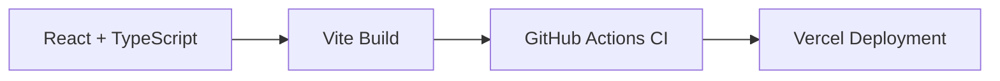

# Girish Challa — Developer Portfolio

[](https://github.com/girishk03/portfolio/actions/workflows/ci.yml)
[](https://girish-challa-portfolio.vercel.app/)
[](LICENSE)

Personal engineering portfolio for Girish Challa, a Python backend developer and Computer Science graduate. Built five production-style projects spanning FastAPI backend engineering, constraint optimization, NLP moderation, analytics dashboards, and computer vision. The portfolio focuses on architecture, trade-offs, testing, and engineering decisions—not inflated product claims.

## Engineering Highlights

- Five substantial engineering projects across backend systems, optimization, NLP, analytics, and computer vision.
- Automated tests and GitHub Actions CI across all five major project repositories.
- Practical experience with FastAPI, PostgreSQL, Docker, OR-Tools, Flask, scikit-learn, YOLOv8, and Streamlit.
- Documentation that separates verified implementation evidence from limitations and future work.

## Live Site

[girish-challa-portfolio.vercel.app](https://girish-challa-portfolio.vercel.app/)

## Featured Work

- **GlobalScart 360** — FastAPI commerce backend with RBAC, multi-stage checkout, PostgreSQL analytics, Dockerized deployment, and CI/CD.
- **University Timetabling Solver** — Hybrid CP-SAT and LNS optimizer with infeasibility diagnostics and schedule validation.
- **Hate Speech Detection** — TF-IDF and LinearSVC classifier with Flask-based YouTube analysis and chatroom moderation interfaces.
- **Power Theft Detection** — Heuristic electricity-risk dashboard for utility investigation prioritization, backed by data-quality reporting and API tests.
- **Smart Marine AI** — YOLOv8n and Streamlit marine-debris prototype with heuristic filtering, exports, and software vessel simulation.

Detailed performance, provenance, and limitation claims belong to each linked project repository and take precedence over portfolio summaries.

## Tech Stack

| Area | Technologies |
| --- | --- |
| Frontend | React, TypeScript, Vite |
| UI | Tailwind CSS, shadcn/ui, Radix UI |
| Motion and visualization | Framer Motion, Recharts |
| Testing | Vitest, Testing Library |
| Quality | TypeScript, ESLint configuration |
| Deployment | Vercel |

## Local Development

Prerequisite: Node.js 20 or later.

```bash
git clone https://github.com/girishk03/portfolio.git
cd portfolio
git switch vercel-deploy
npm ci
npm run dev
```

Open the local URL printed by Vite.

## Validation

```bash
npm run test
npm run build
```

GitHub Actions runs tests and the production build on pushes and pull requests targeting `vercel-deploy`. ESLint is configured, but existing case-study typing errors must be resolved before lint can become a required CI check.

## Project Structure

```text
src/
├── components/      Shared portfolio sections and UI components
├── pages/           Home page and project case studies
├── hooks/           Reusable React hooks
├── lib/             Shared utilities
└── test/            Vitest setup and tests
public/              Resume, certificates, and static project assets
```

## Deployment

The production site is deployed on Vercel from the `vercel-deploy` branch. Vite produces the static application in `dist/`:

```bash
npm run build
```

## Contact

- Portfolio: [girish-challa-portfolio.vercel.app](https://girish-challa-portfolio.vercel.app/)
- GitHub: [github.com/girishk03](https://github.com/girishk03)
- LinkedIn: [linkedin.com/in/challagirish](https://linkedin.com/in/challagirish)
- Email: [saigirishchalla574@gmail.com](mailto:saigirishchalla574@gmail.com)

## Architecture



## License

Project-authored source code is available under the [MIT License](LICENSE). Resume content, certificates, screenshots, logos, and third-party assets retain their respective rights and are not relicensed by the MIT grant.
